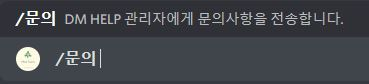
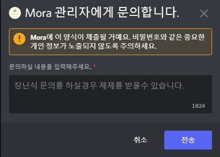
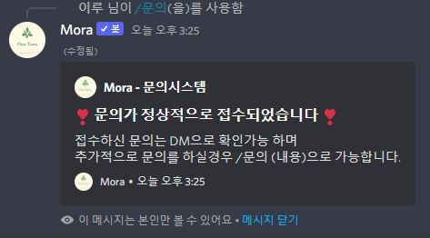
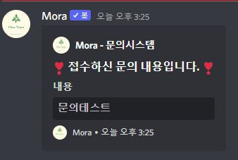

# 문의하기

모라봇의 명령어는 대부분 슬래쉬(/) 명령어로 제작되어 있습니다.

> 명령어 : /문의

모라봇 도움말 명령어는 모라봇의 모든 명령어를 확인할수 있습니다.

<figure><figcaption>
문의명령어를 입력할때 사용합니다.
</figcaption></figure>

<figure><figcaption>
문의 명령어를 사용하신후 문의하실 내용을 작성합니다.
</figcaption></figure>

<figure><figcaption>
문의를 접수한후 채널에 나오는 메시지 입니다.
</figcaption></figure>

<figure><figcaption>
문의 접수를 완료한후 개인DM메시지로 전송되는 내용입니다.
</figcaption></figure>
