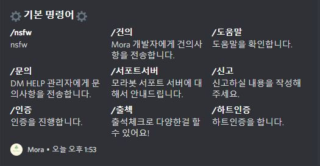
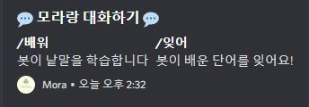
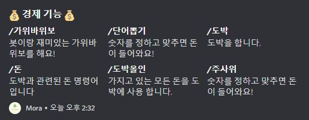
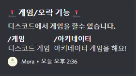
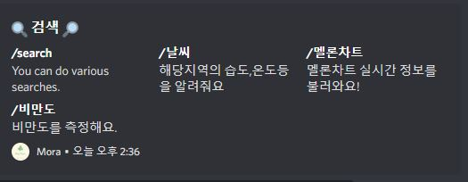
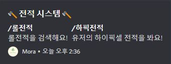
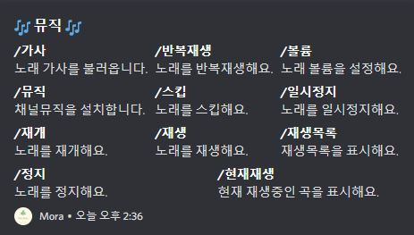
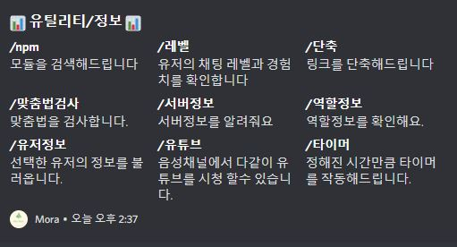
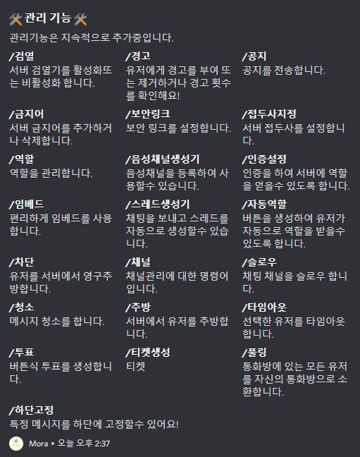

# 도움말

모라봇의 명령어는 대부분 슬래쉬(/) 명령어로 제작되어 있습니다.

> 명령어 : /도움말

모라봇 도움말 명령어는 모라봇의 모든 명령어를 확인할수 있습니다.

<figure><figcaption>
기본기능
</figcaption></figure>

<figure><figcaption>
대화기능
</figcaption></figure>

<figure><figcaption>
경제기능
</figcaption></figure>

<figure><figcaption>
오락기능
</figcaption></figure>

<figure><figcaption>
검색기능
</figcaption></figure>

<figure><figcaption>
전적기능
</figcaption></figure>

<figure><figcaption>
뮤직기능
</figcaption></figure>

<figure><figcaption>
유틸리티
</figcaption></figure>

<figure><figcaption>
관리기능
</figcaption></figure>
